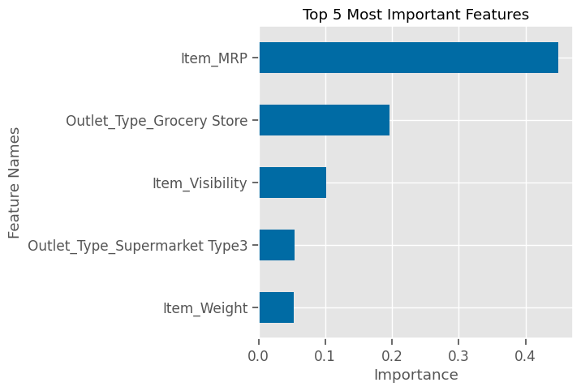
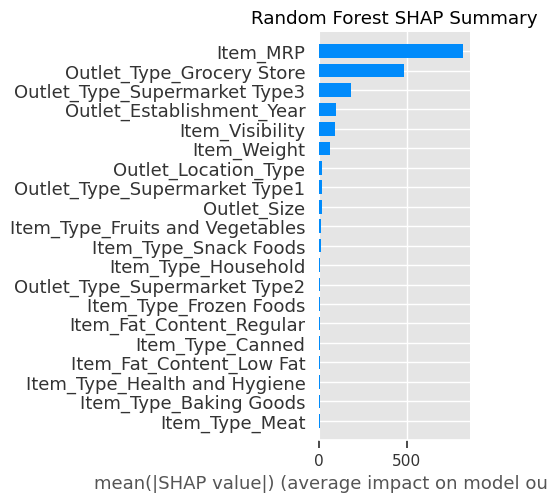
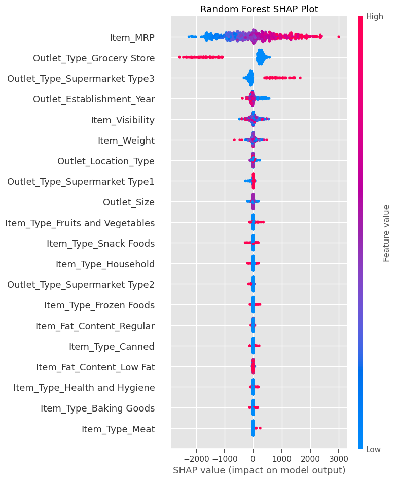

## Predictions of Product Sales

The goal of this is to help the retailer understand the properties of products and outlets that play crucial roles in increasing sales. I will use Pandas to load in the data and start exploring and cleaning it.

## Rosa Rocha

## Data Dictionary

 
  

## DATA CLEANING - To prepare this data, the data was cleaned, and the following processes were performed:
  - Duplicate rows were dropped
  - Rows and Columns (8523, 12)
  - Identify missing values
  - Find and fix any inconsistent categories of data

### Exploratory Data Analysis
    - During the exploratory data analysis, a seaborn countplot and histogram was visualized for numeric datatype column. 
    - Also, a barplot was visualized for categorical column. 
    - This gave a good baseline for the numeric and categorical columns.
    

 
  

This histogram below shows the Medium Outlet Size has more sales than the other 2 Outlet Sizes.

     

 ### Explanatory Data Analysis
    - To visualize the data for explantory purposes, two bargraphs were chosen and one linegraph was chosen.
    - The bargraphs were chosen to show how the categories compare to each other. 
    - Finally, a linegraph was chosen to show the outlet type. 

## Explanatory Visuals

    
 

 
 This barplot shows the top 5 highest selling items though slighly close by average:
  - Starchy Foods            2374.332773
  - Seafood                  2326.065928
  - Fruits and Vegetables    2289.009592
  - Snack Foods              2277.321739
  - Household                2258.784300
 
 

    
 

This lineplot shows that Supermarket type 3 has the most sales compared to the Grocery store which has the lowest of all.

### Maching Learning:Linear Regression Model:
The data was preprocessed before fitting and testing with the machine learning models, however this data was not scaled. 
A Linear Regression model was fitted on the training data and was able to account for about 56% on the testing data.

   

    
   

The three largest coefficients plotted are listed above. This means their coefficients can be interpreted as to how much the target changes. The Target is sales prediction. The three categories are as follows (largest to smallest):

*  Outlet_Type_Supermarket Type3 - For every Rupee increase in an item's MRP the model predicts a 1598.10 increase in revenue for that product.
*  Item_Visibility- For Items with less visibility on display the model is predicting it will bring in 268.41 fewer Rupees than if it had a larger display.
*  Outlet_Type_Grocery Store - if an item sold at a grocery store, the model is predicting to bring in 1714.27 fewer Rupees in revenue than if it sold at a Supermarket Type3.

### Maching Learning:Random Forest Regresson Model:
A Random Forest Regressor model was fitted on the training data and was able to account for about 56% on the testing data.

  

    
  

Top 5 most important features:

* Item_MRP

* Outlet_Type_Grocery Store

* Item_Visibility

* Outlet_Type_Supermarket Type3

* Item_Weight

## Summary Bar Plot: Random Forest
Shap values includes the values for each feature.

  

    
  

According to SHAP the most important features are the:

* Item_MRP
* Outlet_Type_Grocery_Store
* Outlet_Type_Supermarket Type3
* Outlet_Establishment_Year
* Item_Visibility

Both of these Models have 4 out of 5 features that are the same. The difference with the SHAP model is the Outlet_Establishment_year feature is of higher importance than the Item_Weight.

## SHAP Dot Plot for Random Forest Model
  

    
   

According to the SHAP Dot Plot the top 3 most important features are:
* Item_MRP - Item_MRP had the largest effect on the model's predictions (since it was the first bar at the top of the graph).
Because red values are on the right (positive), we can see the greater the price per item, the more likely the model would predict to generate more sales.

* Outlet_Type_Grocery_Store - Because the red dots are on the left (negative) we can see that the grocery store has a decline in sales per item, this model will predict this outlet type to have fewer sales per item than Supermarket Type3.

* Outlet_Type_Supermarket Type3 - Notice that the blue dots (fewer ) are only slightly to the left of the 0-line, indicating that the model is only slightly less likely to predict lower sales per item, compared to the big impact of having a large number of sales per item.

These are the same top 3 features as the RF Shap bar plot.

## Models Evaluated & Results

- Linear Regression Model (Testing Set):
  - MAE: 805.5906 
  - MSE: 1,198,635.9796 
  - RMSE: 1,094.8224 
  - R2: 0.5656

- Decision Tree Regressor Model (Testing Set):
  - MAE: 1,036.6259 
  - MSE: 2,205,788.3951 
  - RMSE: 1,485.1897 
  - R2: 0.2005

- The Final Model Chosen was a Linear Regression Model.

## Recommendations

Model Performance
- Overall, the best model is definitely the Linear Regression Model. The difference between the test score and training score was insignificant and by far it outperformed the Decision Tree Regressor model. 

## Limitations & Next Steps

In order to get a more accurate prediction more detailed data will be needed for a better outcome.

## For Further Information

For any additional questions, please contact: 
- Rosa Rocha
- rosarocha0563@gmail.com
